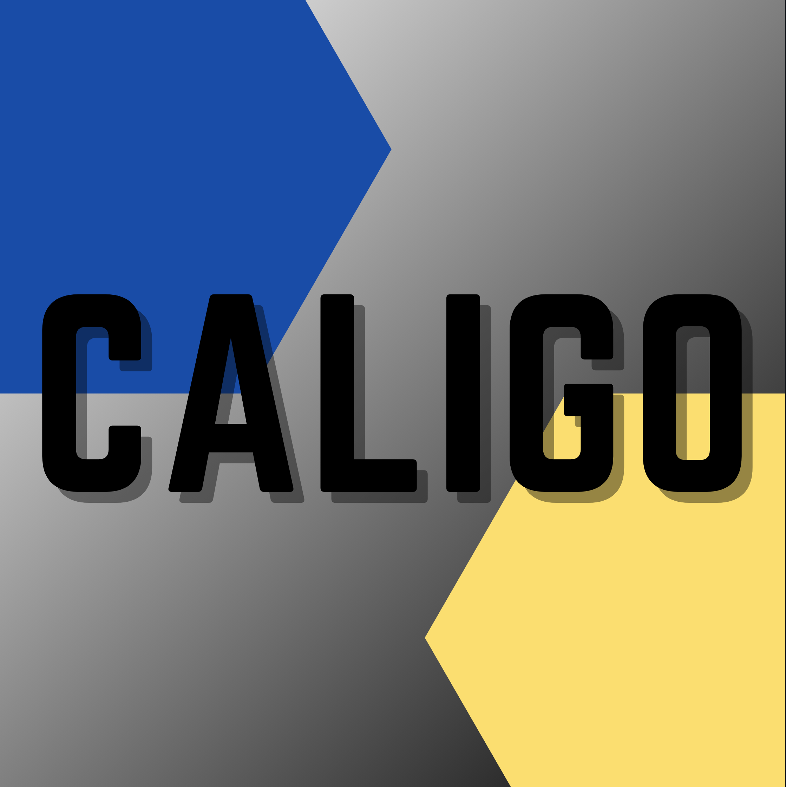

# Caligo

Chrome extension created for LA Hacks 2021, over the course of a week. This extension allows you to enable dark mode and change the default fonts on any webpage! We created this using HTML/CSS, Javascript, and Chrome's APIs.

## Table of Contents

- [Install](#install)
- [Usage](#usage)

## Install

1. Clone the repo
2. Navigate to `chrome://extensions/` in a chrome browser 
3. Enable developer mode on the top right
4. On the top left, click the "unpacked" button and select the src folder in the cloned repo

Congrats! You've now installed the extension!

## Usage

Go to "Details", then "Extension options" to change the font you want Caligo to change webpages to.

On the extension popup, there are 4 buttons and a slider:

- FONT changes the default font for the current webpage to the font that you selected in "Extension options"
- BACK reverts the changes from FONT
- DARKEN enables and disables the slider
- The slider adjusts how dark the webpage should be, if enabled
- STRIP is just a button for fun- it strips the webpage of all CSS, so you can see the naked HTML
